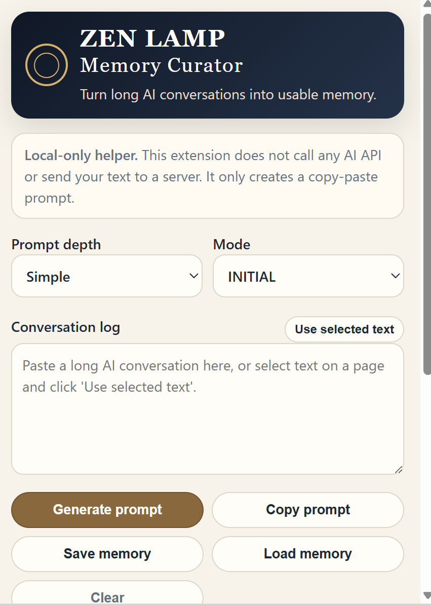

# ZEN LAMP Memory Curator Extension

A simple local browser extension for turning long AI conversations into usable memory.

This is an early personal PoC from the ZEN LAMP PROJECT.

## Screenshot

## What it does

Long AI chats often contain a mix of:

- fixed rules
- project context
- useful discoveries
- temporary notes
- ideas that should be dropped
- next-chat handoff material

Normal summaries are not enough, because the goal is not to preserve everything.

The goal is to decide what should be carried forward.

**More memory is not enough. We need memory governance.**

## Privacy

This extension does **not** send your conversation data to any server.

It does **not** call any AI API.

All text stays in your browser unless you manually copy it into an AI tool.

## How it works

1. Paste a long AI conversation into the extension.
2. Choose **Simple** or **Power User** mode.
3. Choose **INITIAL** or **UPDATE** mode.
4. Generate a Memory Curator prompt.
5. Copy the prompt into ChatGPT, Gemini, Claude, or another AI tool.
6. The AI returns a structured memory output.

## Modes

### Simple

For everyday use.

Outputs:

- Keep
- Maybe
- Drop
- Next Chat Handoff

### Power User

For long projects, writing, research, policy work, product design, and multi-model workflows.

Outputs may include:

- Fixed Rules
- Project Context
- Voice / Style Anchors
- Anti-patterns / Avoid
- Discoveries
- Temporary Notes
- Decisions Pending
- Do Not Carry Forward
- Freshness / Review Needed
- Next Chat Handoff
- Optional AI-specific Handoffs
- Questions to Revisit
- Promotions / Demotions
- Change Log

## Installation for Chrome / Edge

1. Download the latest release from the Releases section.
2. Download `Source code (zip)`.
3. Unzip the file.
4. Open `chrome://extensions/` or `edge://extensions/`.
5. Turn on Developer mode.
6. Click **Load unpacked**.
7. Select the extracted folder containing `manifest.json`.

## Philosophy

This tool is not an answer machine.

It is a small prompt helper for deciding what should be remembered, updated, carried forward, or forgotten.

AI should not silently decide what matters.

The human should choose.

## License

MIT License
